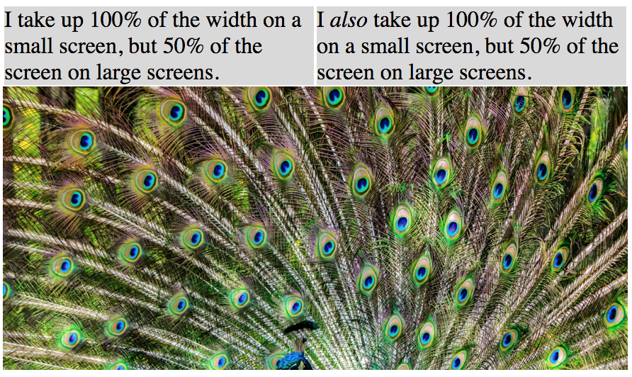
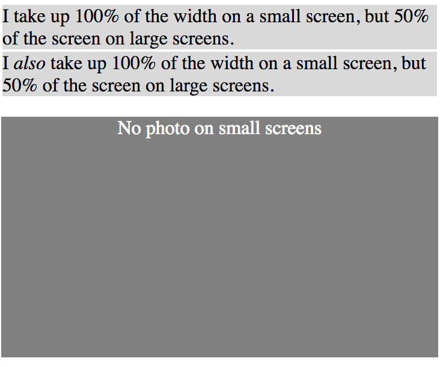

# CSS Media Queries

In these two exercises you'll use media queries to to conditionally apply styles at different screen sizes.

> Remember: In a mobile-first approach, the default styles are built for *small screens*, and style rule are written to progressively enhance the layout on larger screens.

## Challenge # 1

In Chrome, open *ex1/index.html*:

Use one or more media queries to make the page look like this when the width is less than 650px:

## Challenge # 2

First create a new project called "css-media-queries", and then add an *index.html* and *main.css* file. Add the HTML and CSS so that your page looks like the examples below...

Desired layout for large screens (>768px):

Layout for small screens:

